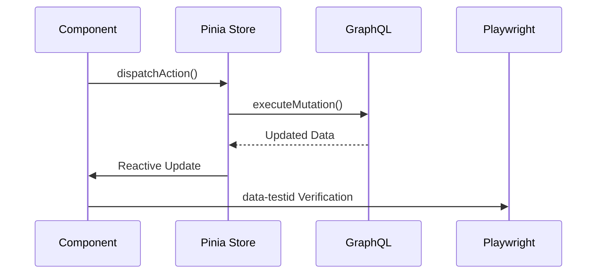
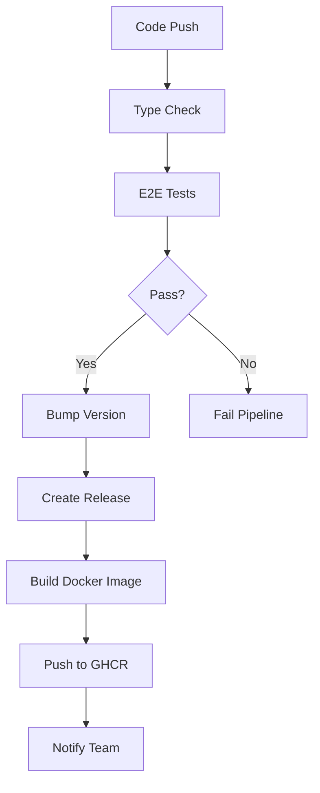

Here's a structured `context.vue.md` file to guide your development process:

```markdown
# Vue.js Application Context Guide

## Core Technologies
- **UI Framework**: `shadcn-vue` (use CLI: `npx shadcn-vue@latest add [component]`), `Tailwind`
- **State Management**: `Pinia` (with stores encapsulating all business logic)
- **GraphQL**: Apollo Client or URQL (calls abstracted through stores)
- **Testing**: `Playwright` (real E2E tests without mocks)
- **Component Library**: Reusable components in `/components`

---

## Project Structure
```bash
src/
├── graphql/
│   ├── mutations/       # All mutation operations
│   │   ├── login.ts
│   │   ├── signup.ts
│   │   └── ...
│   ├── queries/         # All query operations
│   │   └── get-societaire-dossier.ts
│   └── subscriptions/   # Subscription handlers
│
├── interfaces/          # TypeScript interfaces
│   ├── account.ts
│   ├── demande-comm.ts
│   └── ...
│
├── enums/               # TypeScript enums
│   ├── account-type.ts
│   ├── mission-statut.ts
│   └── ...
│
├── stores/              # Pinia stores
│   ├── auth.store.ts    # Authentication store
│   ├── societaire.store.ts # Societaire operations
│   └── ...
│
├── pages/               # Route-level components
│   ├── SocietaireApp.vue
│   ├── AssureurDashboard.vue
│   └── ...
│
└── components/          # Reusable components
    ├── ui/              # shadcn-vue components
    ├── buttons/
    ├── cards/
    └── ...
```

---

## Implementation Rules

### 1. Component Architecture
- **Pages**: Only route-entry components in `/pages`. Must be composed of reusable components.
- **Components**: Break pages into smaller components in `/components`:
  ```vue
  <!-- pages/SocietaireDashboard.vue -->
  <template>
    <DashboardLayout>
      <DocumentUploadCard @submit="handleUpload"/>
      <MissionTimeline :items="timelineData"/>
    </DashboardLayout>
  </template>
  ```

### 2. GraphQL Handling
- **Never call GraphQL directly in components**:
  ```ts
  // ❌ BAD (in component)
  import { loginMutation } from '@/graphql/mutations/login'

  // ✅ GOOD (via store)
  import { useAuthStore } from '@/stores/auth'
  const authStore = useAuthStore()
  authStore.login({ email, password })
  ```

### 3. Pinia Stores Structure
Each store should encapsulate:
- State (reactive data)
- Getters (computed properties)
- Actions (GraphQL operations + business logic)

**Example store**:
```ts
// stores/auth.store.ts
import { defineStore } from 'pinia'
import { loginMutation } from '@/graphql/mutations/login'

export const useAuthStore = defineStore('auth', {
  state: () => ({ user: null as Account | null }),
  
  actions: {
    async login(credentials: LoginInput) {
      const { data } = await apolloClient.mutate({
        mutation: loginMutation,
        variables: credentials
      })
      this.user = data.login
    }
  }
})
```

### 4. Testing Requirements
- **Playwright**:
  - Use `data-testid` attributes:
    ```vue
    <Button data-testid="login-submit">Sign In</Button>
    ```
  - Real E2E tests (no mocks):
    ```ts
    // tests/societaire-login.spec.ts
    test('Societaire login', async ({ page }) => {
      await page.goto('/societaire-login')
      await page.getByTestId('email-input').fill('test@societaire.fr')
      await page.getByTestId('login-submit').click()
      await expect(page).toHaveURL('/societaire-dashboard')
    })
    ```
- **Debugging**: Run tests with `--debug` flag and monitor browser console

### 5. Code Quality Practices
- **Type Safety**: All GraphQL operations must use TypeScript interfaces
- **DRY**: Reuse enums across frontend/backend:
  ```ts
  // enums/mission-statut.ts
  export enum MissionStatut {
    EN_ATTENTE = 'EN_ATTENTE',
    EN_COURS = 'EN_COURS',
    TERMINEE = 'TERMINEE'
  }
  ```
- **Separation of Concerns**:
  - Stores handle data logic
  - Components handle presentation
  - GraphQL files only contain operations

---

## Workflow Checklist
1. Create interface/enum first for new features
2. Add GraphQL operations in relevant mutation/query files
3. Create Pinia store actions that consume GraphQL ops
4. Build page using shadcn-vue components
5. Extract repeating UI patterns to `/components`
6. Write Playwright tests with `data-testid` selectors
7. Verify functionality with real backend (no mocks)
```

Key principles to enforce:
- **Strict component isolation**: Pages are composition roots only
- **Stores as single source of truth**: All data operations go through stores
- **End-to-end type safety**: From GraphQL to UI components
- **Real-world testing**: Playwright tests against actual running backend

Remember to:
1. Use shadcn-vue CLI for consistent components
2. Keep GraphQL operations strictly in `/graphql` directory
3. Verify all data-testid attributes exist in Playwright tests
4. Never commit components with direct GraphQL imports

Here are additional critical elements to enhance the context document for a robust Vue.js application:

### 6. Authentication Flow
- **Token Management**: Stores must handle JWT storage/refresh
- **Route Guards**: Implement navigation guards for protected routes
```ts
// router.ts
router.beforeEach((to) => {
  const authStore = useAuthStore()
  if (to.meta.requiresAuth && !authStore.isAuthenticated) return '/login'
})
```

### 7. Error Handling Standards
- **Global Error Handler**: Centralize API errors
- **User Feedback**: Display actionable error messages
```ts
// stores/auth.store.ts
try {
  await this.login(credentials)
} catch (error) {
  useNotificationStore().showError(
    error.graphQLErrors[0]?.message || 'Login failed'
  )
}
```

### 8. Subscription Management
- **WebSocket Lifecycle**: Automate connection handling
```ts
// stores/notifications.store.ts
onMounted(() => {
  this.subscription = apolloClient.subscribe({ query: NEW_NOTIF_SUBSCRIPTION })
    .subscribe(({ data }) => this.addNotification(data))
})

onUnmounted(() => this.subscription.unsubscribe())
```

### 9. Component Design Rules
- **Props Validation**: Strict type checking
```vue
<script setup lang="ts">
defineProps<{
  urgency: UrgenceMission
  documents: DocumentItem[]
}>()
</script>
```

### 10. Testing Standards
- **Test Structure**: Organize tests by user journey
```
tests/
├── societaire/
│   ├── login.spec.ts
│   ├── document-upload.spec.ts
│   └── mission-flow.spec.ts
└── assureur/
    └── claim-processing.spec.ts
```
- **Accessibility Testing**: Integrate with Playwright
```ts
expect(await page.accessibility.snapshot()).toMatchSnapshot()
```

### 11. Performance Optimization
- **GraphQL Best Practices**:
  - Use `@defer` for slow-resolving fields
  - Implement client-side caching
- **Bundle Analysis**: Add `vite-bundle-visualizer`

### 12. CI/CD Pipeline
```yaml
# .github/workflows/e2e.yml
name: E2E Tests
on: [push]
jobs:
  playwright:
    timeout-minutes: 30
    steps:
      - run: npx playwright install
      - run: npx playwright test
        env:
          BASE_URL: ${{ secrets.LIVE_API_URL }}
```

### 13. Documentation Standards
- **Component Contracts**: Describe props/slots in Markdown
```md
## DocumentUploadCard
**Props**:
- `allowedTypes: DocumentType[]` - Supported file types
- `maxSize: number` - Max file size (MB)
```

### 14. Security Practices
- **XSS Protection**: Sanitize GraphQL responses
```ts
// utils/sanitize.ts
import DOMPurify from 'dompurify'

export const sanitizeHTML = (dirty: string) => DOMPurify.sanitize(dirty)
```

### 15. Observability
- **Monitoring**: Frontend logging standards
```ts
// plugins/logger.ts
export const logError = (error: unknown, component: string) => {
  console.error(`[${component}]`, error)
  useMonitoringStore().trackError(error)
}
```

### Critical Addition: Live Data Strategy


### Essential Checks Before Committing:
1. All store actions include error handling
2. Every interactive element has `data-testid`
3. TypeScript interfaces match backend schema
4. Playwright tests cover critical user journeys
5. GraphQL operations use enums not hardcoded strings
6. No direct GraphQL imports in components
7. All shadcn-vue components are properly themed
8. Subscription cleanup exists in `onUnmounted` hooks
9. Sensitive data excluded from test IDs
10. E2E tests run against real API in CI pipeline

This comprehensive approach ensures production-grade quality while maintaining developer velocity through strict conventions and automation.


Here's the enhanced CI/CD, licensing, and issue management section to add to your context document:

---

## CI/CD Pipeline (GitHub Actions)

### Workflow Structure (`.github/workflows/main.yml`):
```yaml
name: CI/CD Pipeline
on:
  push:
    branches: [main]
  pull_request:
    branches: [main]

jobs:
  type-check:
    runs-on: ubuntu-latest
    steps:
      - uses: actions/checkout@v4
      - uses: actions/setup-node@v4
        with:
          node-version: 20
      - run: npm ci
      - run: npm run type-check  # "type-check": "tsc --noEmit" in package.json

  e2e-tests:
    needs: type-check
    runs-on: ubuntu-latest
    timeout-minutes: 30
    steps:
      - uses: actions/checkout@v4
      - uses: actions/setup-node@v4
        with:
          node-version: 20
      - run: npm ci
      - run: npx playwright install
      - run: npx playwright test
        env:
          BASE_URL: ${{ secrets.LIVE_API_URL }}
          TEST_USER: ${{ secrets.TEST_USER }}
          TEST_PASSWORD: ${{ secrets.TEST_PASSWORD }}

  release:
    needs: e2e-tests
    if: github.ref == 'refs/heads/main'
    runs-on: ubuntu-latest
    steps:
      - uses: actions/checkout@v4
        with:
          fetch-depth: 0
      
      - name: Bump version
        uses: phips28/gh-action-bump-version@v10
        with:
          tag-prefix: 'v'
          commit-message: 'chore(release): v{{version}}'
          tag-message: 'Release v{{version}}'
          default-bump: patch
          skip-tag: true
          skip-commit: true
          create-annotated-tag: true
        env:
          GITHUB_TOKEN: ${{ secrets.GITHUB_TOKEN }}
          
      - name: Create Release
        uses: actions/create-release@v2
        id: create_release
        with:
          tag_name: v${{ env.NEW_VERSION }}
          release_name: Release v${{ env.NEW_VERSION }}
          draft: false
          prerelease: false
        env:
          GITHUB_TOKEN: ${{ secrets.GITHUB_TOKEN }}

  dockerize:
    needs: release
    runs-on: ubuntu-latest
    steps:
      - uses: actions/checkout@v4
      - name: Build Docker image
        run: |
          docker build -t ghcr.io/${{ github.repository }}:${{ steps.version.outputs.new_version }} .
      - name: Push to GHCR
        uses: docker/login-action@v3
        with:
          registry: ghcr.io
          username: ${{ github.actor }}
          password: ${{ secrets.GITHUB_TOKEN }}
      - run: docker push ghcr.io/${{ github.repository }}:${{ steps.version.outputs.new_version }}
```

### Support Files:

**1. Dockerfile:**
```dockerfile
# Development stage
FROM node:20-alpine as dev
WORK /app
COPY package*.json ./
RUN npm ci
COPY . .
CMD ["npm", "run", "dev"]

# Production stage
FROM node:20-alpine as builder
WORK /app
COPY package*.json ./
RUN npm ci
COPY . .
RUN npm run build

FROM nginx:stable-alpine as production
COPY --from=builder /app/dist /usr/share/nginx/html
COPY nginx.conf /etc/nginx/conf.d/default.conf
EXPOSE 80
CMD ["nginx", "-g", "daemon off;"]
```

**2. nginx.conf:**
```nginx
server {
  listen 80;
  server_name localhost;

  location / {
    root /usr/share/nginx/html;
    index index.html;
    try_files $uri $uri/ /index.html;
  }

  error_page 500 502 503 504 /50x.html;
  location = /50x.html {
    root /usr/share/nginx/html;
  }
}
```

**3. Issue Templates (`.github/ISSUE_TEMPLATE`):**

`bug_report.md`:
```markdown
---
name: 🐛 Bug Report
about: Report unexpected behavior or defects
labels: bug
---

## Describe the Bug
Clear and concise description of the issue

## Steps to Reproduce
1. Go to '...'
2. Click on '....'
3. Scroll down to '....'
4. See error

## Expected Behavior
What you expected to happen

## Screenshots/Recordings
If applicable, add visual evidence

## Environment
- Device: [e.g., MacBook Pro]
- OS: [e.g., macOS Ventura 13.4]
- Browser [e.g., Chrome 115]
- Version [e.g., 1.2.3]

## Additional Context
Any other relevant information
```

`feature_request.md`:
```markdown
---
name: ✨ Feature Request
about: Suggest an enhancement
labels: enhancement
---

## Is your feature request related to a problem?
Description of the problem

## Proposed Solution
Detailed description of your solution

## Alternatives Considered
Other approaches you considered

## Additional Context
Screenshots, diagrams, or use cases
```

`improvement.md`:
```markdown
---
name: 🔧 Improvement
about: Suggest technical improvements
labels: improvement
---

## Current Behavior
What needs optimization

## Proposed Improvement
Technical solution details

## Impact Areas
Affected components/modules

## Additional Context
Performance metrics or benchmarks
```

## License (MIT)
Create `LICENSE` in project root:
```text
MIT License

Copyright (c) [year] [fullname]

Permission is hereby granted, free of charge, to any person obtaining a copy
of this software and associated documentation files (the "Software"), to deal
in the Software without restriction, including without limitation the rights
to use, copy, modify, merge, publish, distribute, sublicense, and/or sell
copies of the Software, and to permit persons to whom the Software is
furnished to do so, subject to the following conditions:

The above copyright notice and this permission notice shall be included in all
copies or substantial portions of the Software.

THE SOFTWARE IS PROVIDED "AS IS", WITHOUT WARRANTY OF ANY KIND, EXPRESS OR
IMPLIED, INCLUDING BUT NOT LIMITED TO THE WARRANTIES OF MERCHANTABILITY,
FITNESS FOR A PARTICULAR PURPOSE AND NONINFRINGEMENT. IN NO EVENT SHALL THE
AUTHORS OR COPYRIGHT HOLDERS BE LIABLE FOR ANY CLAIM, DAMAGES OR OTHER
LIABILITY, WHETHER IN AN ACTION OF CONTRACT, TORT OR OTHERWISE, ARISING FROM,
OUT OF OR IN CONNECTION WITH THE SOFTWARE OR THE USE OR OTHER DEALINGS IN THE
SOFTWARE.
```

---

## Automation Workflow



## Required Secrets
| Name                | Description                     |
|---------------------|---------------------------------|
| LIVE_API_URL        | Production API endpoint        |
| TEST_USER           | E2E test credentials (email)   |
| TEST_PASSWORD       | E2E test credentials           |
| GHCR_TOKEN          | GitHub Container Registry token|

## Pipeline Rules
1. **Fail Fast**: Type errors immediately stop pipeline
2. **Real Environment**: Tests run against production-like environment
3. **Semantic Versioning**: Patch version auto-increment on main merge
4. **Immutable Releases**: Each release gets unique Docker tag
5. **Security Scanning**: Add Trivy vulnerability scan step (optional)

To enable complete workflow:
1. Add secrets in GitHub repository settings
2. Ensure Docker and Playwright are properly configured
3. Set branch protection rules requiring CI pass for merges
4. Configure GitHub Packages for container registry

This setup provides:
✅ Full automation from code commit to production deployment
✅ Production-grade containerization
✅ Standardized issue tracking
✅ License compliance
✅ Versioned releases
✅ End-to-end quality verification


and never ever write TODOS on features to implement, just implement them.